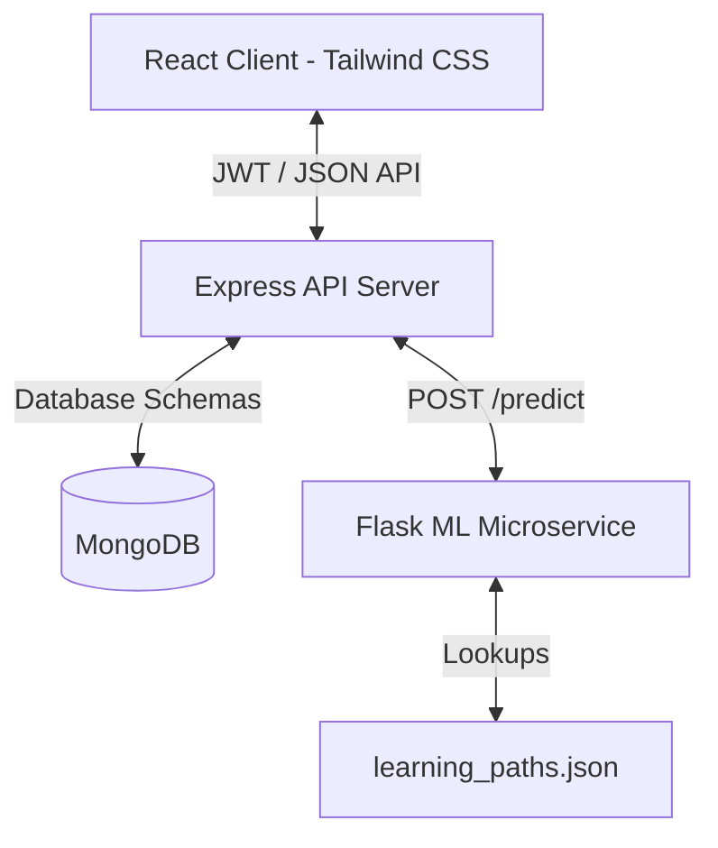

# GrowthPath AI - AI Talent Intelligence & Job Recommendation Platform

GrowthPath AI is a modern, full-stack career development platform. It uses Natural Language Processing (NLP) to match user skills to job postings, perform skill-gap analyses, and generate personalized educational suggestions. 

The application is structured as a multi-tier microservice architecture with secure JWT user sessions, MongoDB bookmark storage, and a responsive glassmorphic dashboard.

---

## ⚙️ Microservices Architecture



### 1. Frontend Web Client (React + Tailwind CSS v4)
* A glassmorphic single-page application built on Vite + React.
* Translucent auth modal supporting user signup, login, and token rehydration.
* Interactive matching cards with animated match-percentage indicators.
* Detailed skill badges mapping **Matched Skills** vs. **Missing Skills**.
* AI Learning Path suggestions displayed as dynamic play-card recommendations.
* Persistent left-hand search history panel synced from MongoDB.

### 2. API Gateway Server (Node.js + Express + MongoDB)
* Connected to MongoDB using Mongoose.
* **Auto-Seeding**: Automatically seeds the MongoDB `jobs` collection with 32 sample jobs on startup if empty.
* **JWT Authorization**: Intercepts requests using middleware to validate Bearer tokens.
* **Deduplicated History**: Intercepts user searches and updates timestamps for identical queries instead of writing duplicates.
* **Database Object ID Mapping**: Injects MongoDB `_id` keys into NLP-recommended results, connecting ML predictions with database collections.

### 3. AI Service (Python Flask + Scikit-Learn)
* Fits a `TfidfVectorizer` across all job skills on boot.
* Custom tokenization that preserves special character languages (like `C++`, `C#`, `.NET`, `Go`, `R`) and multi-word terms (like `Machine Learning`) that standard tokenizers strip.
* Uses **Cosine Similarity** to compute exact match relevance.
* Runs skill gap lookups against `learning_paths.json` to return step-by-step tutorials for missing competencies.
* Validates inputs, issuing warnings for unrecognized skills and returning `400 Bad Request` if no skills match.

---

## 📂 Project Structure

```text
Job-Recommendation/
├── .gitignore
├── README.md                 # Master documentation
├── job-recommender/
│   ├── ml-service/
│   │   ├── app.py            # Flask server & NLP engine
│   │   ├── jobs.json         # Jobs dataset (32 roles)
│   │   ├── learning_paths.json # Skills-to-learning-paths dictionary
│   │   └── requirements.txt  # Flask ML dependencies
│   ├── server/
│   │   ├── server.js         # Node backend, seeding, and database connection
│   │   ├── .env              # Server configurations & JWT secrets
│   │   ├── package.json      # Express dependencies
│   │   ├── middleware/
│   │   │   └── auth.js       # JWT validation middleware
│   │   ├── models/
│   │   │   ├── Job.js        # Mongoose schema for jobs
│   │   │   ├── User.js       # Mongoose schema for hashed accounts
│   │   │   └── Bookmark.js   # Mongoose schema for bookmarks
│   │   └── routes/
│   │       ├── auth.js       # signup/login endpoints
│   │       ├── bookmarks.js  # bookmark CRUD actions
│   │       └── recommend.js  # search gateway & history router
│   ├── client/
│   │   ├── index.html        # HTML shell loading Outfit & Inter fonts
│   │   ├── package.json      # React dependencies
│   │   ├── postcss.config.js # CSS plugins
│   │   ├── tailwind.config.js# Tailwind parameters
│   │   ├── src/
│   │   │   ├── main.jsx      # Vite injection point
│   │   │   ├── index.css     # CSS custom glows & glass themes
│   │   │   ├── App.jsx       # Forms, tabs, and login state manager
│   │   │   └── components/   # Reusable components (JobCard, AuthModal, etc.)
│   └── test_extensions.py    # Integration test suite (urllib-based)
```

---

## 🛠️ Step-by-Step Setup & Running Guide

You will need **MongoDB**, **Node.js**, and **Python 3.8+** installed. Open 4 separate terminal tabs to run all components:

### Tab 1: MongoDB Database
Start your local MongoDB instance (if installed via Homebrew):
```bash
mongod --config /opt/homebrew/etc/mongod.conf
```
*Port: `27017`*

### Tab 2: AI Microservice (Python Flask)
Install python packages and start the ML prediction server:
```bash
cd job-recommender/ml-service
pip install -r requirements.txt
python3 app.py
```
*Port: `5005`*

### Tab 3: API Gateway (Node.js Express)
Configure your `.env` file inside `job-recommender/server/`:
```env
PORT=5002
MONGODB_URI=mongodb://localhost:27017/job-recommender
ML_SERVICE_URL=http://localhost:5005/predict
JWT_SECRET=supersecrettoken12345
```
Install dependencies and run the server:
```bash
cd job-recommender/server
npm install
npm start
```
*Port: `5002` (Self-seeds on first startup)*

### Tab 4: Web Client (React + Vite)
Install packages and start the hot-reloading dev environment:
```bash
cd job-recommender/client
npm install
npm run dev
```
*Port: `5173` (Open **`http://localhost:5173/`** in your browser)*

---

## 🔌 API Gateway Specifications

### **1. User Authentication**
* **POST `/api/auth/register`**: Register a new account.
  - Body: `{"email": "dev@test.com", "password": "mypassword"}`
* **POST `/api/auth/login`**: Authenticate and retrieve token.
  - Body: `{"email": "dev@test.com", "password": "mypassword"}`
  - Returns: `{"token": "JWT_TOKEN", "user": {"id": "...", "email": "..."}}`

### **2. Job Recommendations**
* **POST `/api/recommend`**: Fetch similarity matches for a skill set.
  - Headers: `Authorization: Bearer <JWT_TOKEN>` (Optional: history logging still works)
  - Body: `{"skills": "React, TypeScript"}`

### **3. Bookmarks Management (Protected)**
* **POST `/api/bookmarks`**: Save a job recommendation.
  - Headers: `Authorization: Bearer <JWT_TOKEN>`
  - Body: `{"jobId": "MONGO_JOB_ID"}`
* **GET `/api/bookmarks/:userId`**: Load saved bookmarks.
  - Headers: `Authorization: Bearer <JWT_TOKEN>`
* **DELETE `/api/bookmarks/:jobId`**: Remove a bookmark.
  - Headers: `Authorization: Bearer <JWT_TOKEN>`
